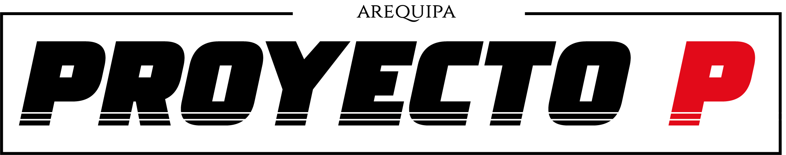

 
 

# QUE ES EL PROYECTO "PASEA"?
Proviene de las siglas Proyecto de Ayuda Social por Estudiantes en Arequipa. Este proyecto tiene
como objetivo dar la ayuda social, para niños jóvenes y adultos en este proyecto estará abocado
lo que no solo es el la ayuda sino también la enseñanza de algo nuevo para ellos, que los jóvenes
de hoy en día se interesen más en lo que es el apoyo social y también va de la mano con el
apoyo que les pueda dar a las instituciones educativas al momento de hacer algún proyecto que
ellos sean beneficiados con puntos extracurriculares o prácticas de aplicación de conocimientos
avanzados.
 
 

# OBJETIVO
De acuerdo a la investigación hacia nuestro
objetivo es destacar la innovación, compartir conocimientos, servir y ayudar a las personas, poder crear vínculos mediante actividades, crear una alternativa fácil de apoyo social, dar fácil acceso virtual en la búsqueda de entidades de ayuda social en la región Arequipa-
 
 

# AUTORES
<ul>
    <li>Manuel Mogrovejo Arenas </li>
    <li>Rodrigo Otazú Quispe</li>
</ul>
